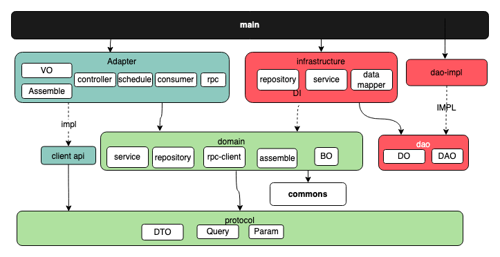

# wgq-chat

#### 介绍
基于整洁架构搭建的个人IM开源项目,通过Netty实现和前端websocket连接。内含有登录，成员列表，联系人，
群组，群组成员，好友，好友分组，黑名单，消息记录，消息撤回，消息已读，消息点赞，还有很多小轮子项目
例如通过AOP实现日志，分布锁注解，频控注解，ip解析归属地等，持续更新中。。。

#### 开源地址
码云仓库：https://gitee.com/wang-guoqingyy/wgq-chat.git
Github: https://github.com/780886/wgq-chat.git

#### 整洁架构落地

参考：
1. https://www.jianshu.com/p/595b27818f2d
2. https://www.jianshu.com/p/4cf50cf3e127

#### 安装教程

1.  下载wgq-sheep：https://gitee.com/wang-guoqingyy/wgq-sheep
    
    ``执行mvn clean install -Dmaven.test.skip编译``
2.  下载passport：https://gitee.com/wang-guoqingyy/passport
    
    ``执行mvn clean install -Dmaven.test.skip编译``
3.  最后在wgq-chat根目录下
    
    ``执行mvn clean install -Dmaven.test.skip编译``

### 环境搭建

在项目目录下的`application.yml`修改自己的启动环境`spring.profiles.active` = `test`然后找到同级文件`application-test.properties`，填写自己的环境配置后,
启动ImApplication。

#### 后端技术

|        技术         | 说明                                       | 官网                                                         |
| :-----------------: | ------------------------------------------ | ------------------------------------------------------------ |
|     SpringBoot      | web开发必备框架                            | [https://spring.io/projects/spring-boot](https://spring.io/projects/spring-boot) |
|       MyBatis       | ORM框架                                    | http://www.mybatis.org/mybatis-3/zh/index.html               |
|        Redis        | 缓存加速，多数据结构支持业务功能           | [https://redis.io](https://redis.io)                         |
|        Nginx        | 负载均衡，https配置，websocket升级，ip频控 | [https://nginx.org](https://nginx.org)                       |
|       Docker        | 应用容器引擎                               | [https://www.docker.com](https://www.docker.com)             |
|         Oss         | 对象存储                                   | [https://letsencrypt.org/](https://letsencrypt.org/)         |
|         Jwt         | 用户登录，认证方案                         | [https://jwt.io](https://jwt.io)                             | |
|     Swagger-UI      | API文档生成工具                            | https://github.com/swagger-api/swagger-ui                    | |
|        minio        | 自建对象存储                               | https://github.com/minio/minio                               |

## License
[Apache License 2.0](./LICENSE)
